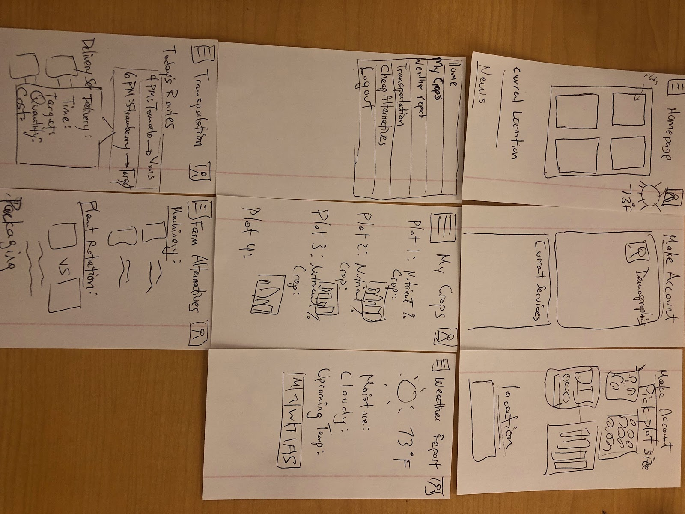
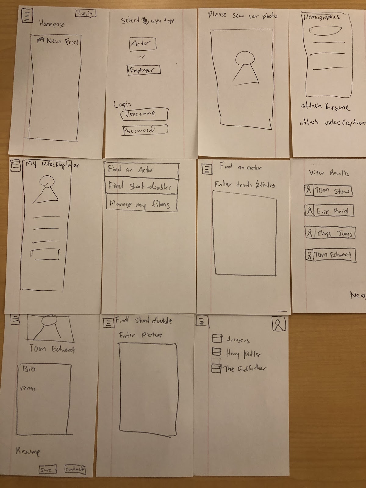
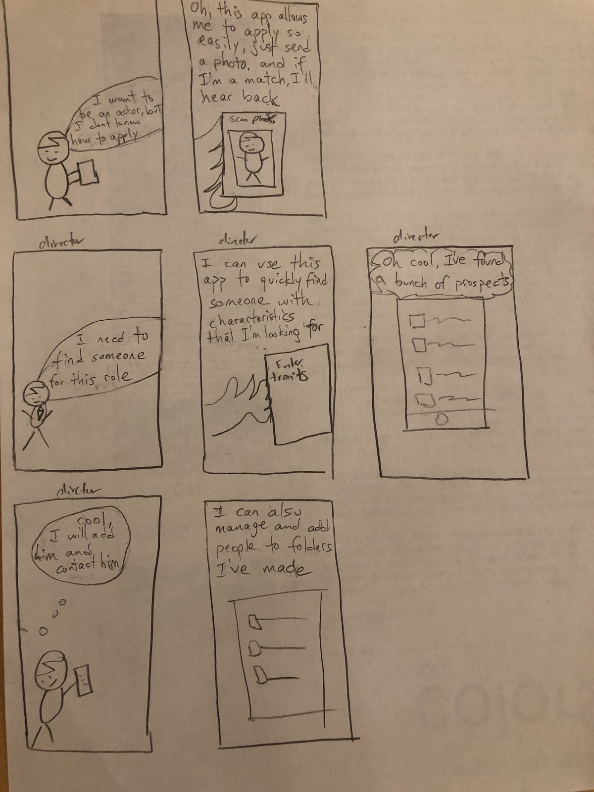

# 4square
COGS 121 Project

* Richard Peña
* Sadeem Khan
* Christian Lay
* Brandon Lien

## Project Proposal

### Farm2Fresh
---
Our target demographic is going to be Farmers who are just getting started and maybe need a little bit more knowledge in order to produce the best crop. So many factors come into play when picking a crop: soil, water, sunlight, plot size, temperature...
None of our team members are part of the users population because we have no idea what it takes to manage a farm, choose the right crop, or what tools are neccessary for the varying sizes of farms. 
We plan to use TrefleAPI to get plant data, Fruit and Vegetable Prices dataset that can be found on data.gov to train our recommender systems, and a Storm Prediction Report for climate related solutions

#### Farm Prototype
---

#### Farm Storyboard
---

#### Actor Prototype
---

#### Actor Storyboard
---

