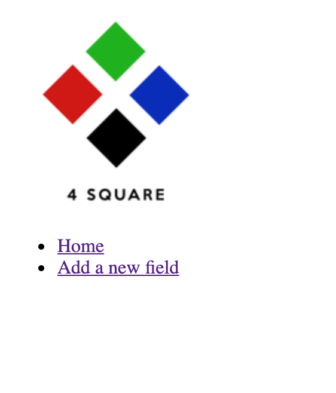
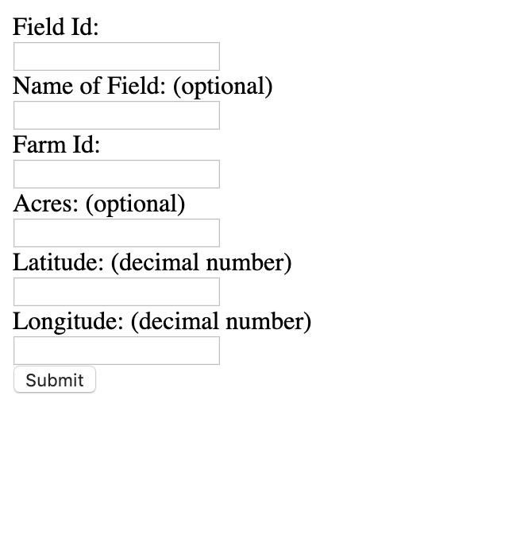
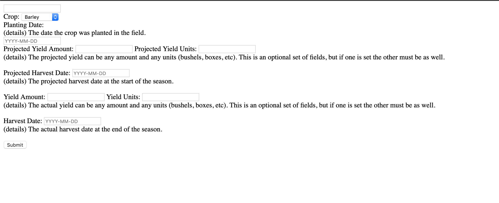
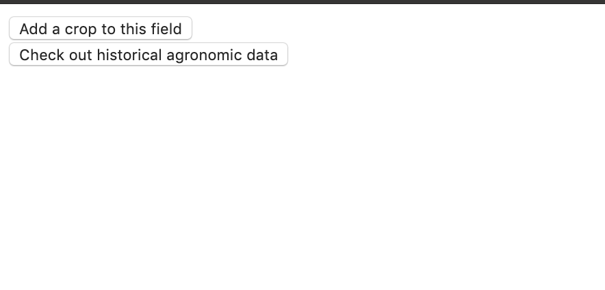

# 4square
COGS 121 Project

* Richard Pena
* Sadeem Khan
* Christian Lay
* Brandon Lien

## Project Skeleton

### Farm2Fresh
--

The UI skeleton has improved in a number of ways. The first noticeable 
change is that from the homepage the user is now able to add a field 
of their farm. The user can click on addField which takes them to another
webpage where they are able to choose from a list of crops. Upon adding the
field, the farmer will be able to see the field display in his homepage.

If the farmer selects any of their fields from the homepage, they are 
taken to another page that shows planting associated with that field. They 
are also able to add a crop from this page that takes them to the addCrop
page. There are also some styling changes as each webpage now has a background
image. 

### UI Webpages
---

### Homepage

### Adding a Field

### Adding a Crop

### Field Options

