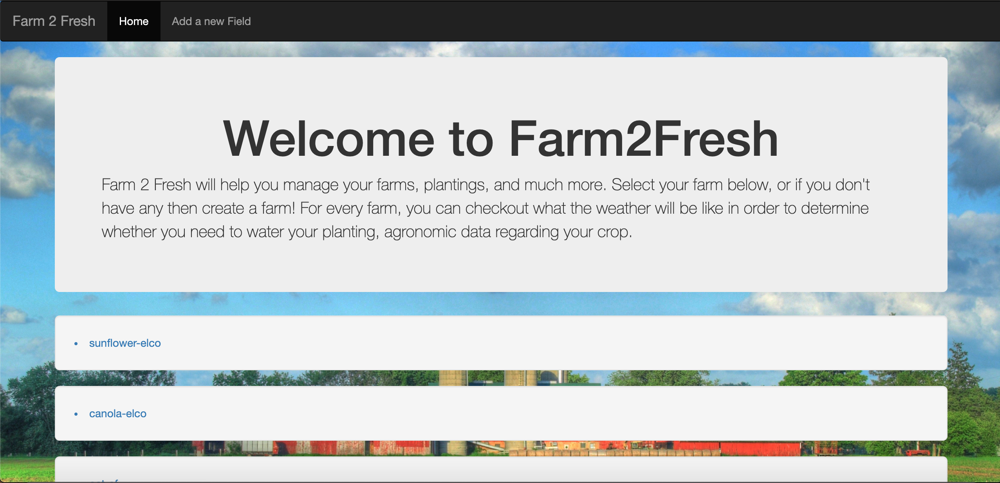
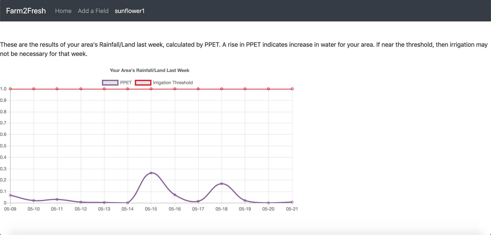

# 4square
COGS 121 Project

* Richard Pena
* Sadeem Khan
* Christian Lay
* Brandon Lien

## Project Skeleton

### Farm2Fresh
--

The screenshots of our UI have improved in a few noticeable ways.
We have updated the UI of our homepage. We removed the old 4Square 
logo and added the app name in the navbar. There is also an a quick
paragraph on the homepage about what Farm2Fresh offers followed by 
the users farms underneath it. There are a few farms that are shown 
underneath this and they are clickable links that take you to that 
specific crop. When you click on one of them, it takes you to a page 
about that crop that shows weather information. In the form of a graph 
we have rainfall data.

The add field page has also changed in its styling. The field for 
adding a new field is now in its own box and is shown in the middle
of the page for better style

### UI Webpages
---

### Homepage

### Adding a Field

### Your Crop

